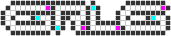

##  Generic Random Level Generator

## Installation
tba
node.js
bower

## Description
https://furka.github.io/grlg/

## Features

- Generates a 2-dimensional map of open/closed cells
- Generate windy cave tunnels, sewer networks, open areas or anything in between.
- All open cells are guaranteed to be accessible
- No dependencies

## API

```javascript
var map = new GRLG(width, height);
```

```javascript
map.generate(options, done, update);
```

```javascript
map.print(size, canvas);
```

```javascript
map.get(x, y);
```

## Usage

Instantiate a new map with a width and height

```javascript
var width = 20;
var height = 20;
var map = GRLG(width, height);
```

Configure and initiate tile generation

```javascript
//configure tile generation - all options optional
var options = {
  min: 20,               //minimum amount of open cells generated
  max: 50,               //maximum amount of open cells generated
  speed: 1,              //amount of cells generated on each tick
  density: density,      //value between 0 and 1, 0 means more tunnels
  linearity: linearity   //value between 0 and 1, 1 means straight tunnels
};

//define callback functions
//callbacks are optional, but a done function is recommended to be notified when generation is complete
function done () {}
function update () {}

//initialize map generation
map.generate(options, done, update);
```

Poll map for open or closed tiles - This is where you would integrate with your own system

```javascript
for (var x = 0; x < map.width; x += 1) {
  for (var y = 0; y < map.height; y += 1) {
    console.log(map.get(x, y));
  }
}
```

Output visible map

```javascript
var canvas = map.print(5);
document.body.appendChild(canvas);
```


## License
grlg.js is licensed under the MIT license. You may use it for commercial use.
