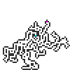
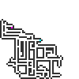
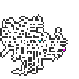
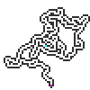
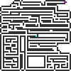
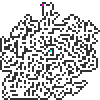

##  Generic Random Level Generator


## Installation
tba
node.js
bower

## Description
GRLG is an asynchronous map generator that can be used in HTML5 games or other Javascript applications.

[Click here for a live demo of GRLG](https://furka.github.io/grlg/demo/)

##### Example maps:








## Features

- Generates a 2-dimensional map of open/closed cells
- Generate windy cave tunnels, sewer networks, open areas or anything in between.
- All open cells are guaranteed to be accessible
- Can be integrated into a main loop or run independently
- No dependencies

## API

```javascript
var map = new GRLG(width, height);
```

```javascript
map.configure(options);
```

```javascript
map.generate();
```

```javascript
map.generateAll(completed, update);
```

```javascript
map.get(x, y);
```

```javascript
map.print(size, canvas);
```

## Usage

Instantiate a new map with a width and height

```javascript
var width = 20;
var height = 20;
var map = GRLG(width, height);
```

Configure map

```javascript
//all settings are optional
map.configure({
  min: 20,         //minimum amount of open cells generated
  max: 50,         //maximum amount of open cells generated
  speed: 1,        //amount of cells generated on each tick
  density: 0,      //value between 0 and 1, 0 means more tunnels
  linearity: 0     //value between 0 and 1, 1 means straight tunnels
});
```
Generate map within your main loop

```javascript
function gameloop () {
  if (!map.completed) {
    map.generate();
  } else {
    //map is ready!
  }
}

setInterval(gameLoop, 1000 / 60);
```

Alternatively, you can let the map generate independently
```javascript
//define completed and update callbacks
function completed () {
  console.log('map is ready!');
}

function update () {
  console.log('map is generating...');
}

map.generateAll(completed, update);
```

Poll map for open or closed tiles - This is where you would integrate with your own system

```javascript
for (var x = 0; x < map.width; x += 1) {
  for (var y = 0; y < map.height; y += 1) {
    //prints true for an open cell, false when closed or undefined when empty
    console.log(map.get(x, y));
  }
}
```

Output visible map when done

```javascript
var scale = 5; //scale in pixels
var canvas = map.print(scale);
document.body.appendChild(canvas);
```

Visualizing the map while it's generating.

```javascript
var map = new GRLG(width, height);

//create reusable canvas
var canvas = document.createElement('canvas');
document.body.appendChild(canvas);

map.generateAll(null, function () {
  //output map on our reusable canvas at a scale of 3 pixels
  map.print(3, canvas);
});
```

## License
grlg.js is licensed under the MIT license. You may use it for commercial use.
